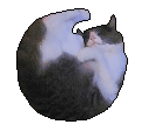

  

<h1 align="center">Chloe OS | A fun and creative "operating system"</h1>

### 🧑‍🦰 by Spacy_Garfield

Last Updated: 11-02-25

## Introduction
Chloe OS is a fun and creative "operating system" that is used not only as a neat "nice-have" for anyone to try, but also served as the "ultimate test" of my 3+ years of programming skills. The inspiration for this project comes from a couple of different sources:
- My lovely little cat named **Chloe** (hence the name);
- An unreleased .NET project of mine (with complex C# and architectural implementations);
- The Windows 10/11 operating systems by [Microsoft](https://www.microsoft.com/en-ca);
- My passion for C# .NET Full-Stack development.

## Technologies Used
This project will use the following technologies:
- 💻 C# MVC, .NET Core 8;
- ☁️ Entity Framework Core 8 with a MySQL database connected;
- 🦴 HTML, CSS3, and JavaScript;
- 🤵 Semantic UI (used as additional "professional-looking" UI design);

** More may be added in the future... who knows..?

## What's next?
For now, this project has barely been started. Of course, in the near future (hopefully...), there will be many other files to be used and instructions for you to try locally!
